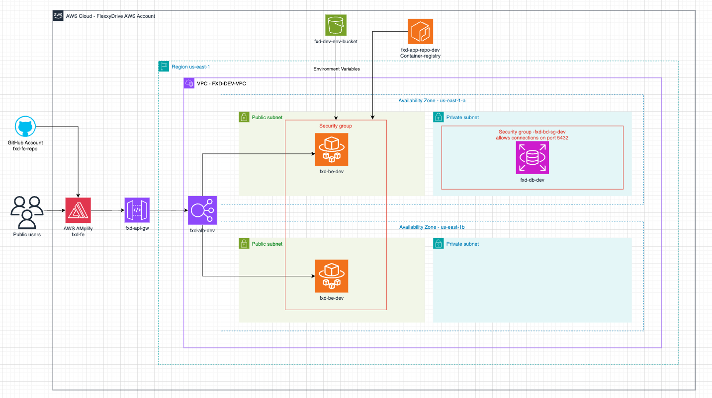

# 

# **FlexxyDrive ECS Deployment**

## **📌 Project Overview**

This project automates the deployment of a **Django application** on **AWS ECS Fargate**, leveraging **AWS CDK** (Cloud Development Kit) for infrastructure as code. The application is containerized and pulled from **Amazon ECR** (Elastic Container Registry). The deployed service is exposed via an **Application Load Balancer (ALB)**.

---

## **📁 Architecture Diagram**



link to diagram: https://app.diagrams.net/#G1U8YgA-yF3qruaIVubPiLUX4tUgyvZEnV#%7B%22pageId%22%3A%22hkURX9IO6jarHgWGMcFt%22%7D

This diagram illustrates the deployment structure, including **ECS, ALB, ECR, VPC, and S3 integrations**.

---

## Endpoints

https://tmgla2ha48.execute-api.us-east-1.amazonaws.com/

---


<p align="center">
  
  
  
</p>


## **🔧 Tech Stack**

- **AWS CDK** (Infrastructure as Code)
- **Amazon ECS (Fargate)**
- **Amazon ECR** (Pre-existing container repository)
- **Amazon VPC** (Public Subnet for ECS tasks)
- **Application Load Balancer (ALB)**
- **IAM Roles & Policies**
- **Amazon S3** (For environment variable storage)
- **Python 3.12 & Django**
- **Docker** (Containerization)

---

## **⚙️ Setup & Deployment**

### **1️⃣ Prerequisites**

Ensure you have the following installed:

- [AWS CLI](https://aws.amazon.com/cli/)
- [Node.js (16+)](https://nodejs.org/en/)
- [AWS CDK](https://docs.aws.amazon.com/cdk/latest/guide/work-with-cdk.html)
- [Docker](https://www.docker.com/)

### **2️⃣ Clone the Repository**

```sh
git clone https://github.com/your-repo/flexxidrive-ecs.git
cd flexxidrive-ecs
```

### **3️⃣ Install Dependencies**

```sh
npm install
```

### **4️⃣ Configure AWS Credentials**

Ensure your AWS CLI is authenticated:

```sh
aws configure
```

### **5️⃣ Deploy the Stack**

```sh
cdk deploy
```

This will provision the required AWS resources, including ECS, ALB, Security Groups, and IAM roles.

---

## **🛠 Key Configuration Details**

### **ECS Cluster & Service**

- **VPC:** Public Subnet (Ensures ECS tasks have internet access)
- **Task Execution Role:** `AmazonECSTaskExecutionRolePolicy` for ECR access
- **Security Groups:** ALB & ECS Security Groups allow HTTP (80) and HTTPS (443)
- **Load Balancer:** Public ALB routes traffic to ECS tasks on port 8000

### **Environment Variables**

Environment variables are stored in **Amazon S3** for security.

### **Pre-existing ECR Repository**

- **ECR URI:** `361769583226.dkr.ecr.us-east-1.amazonaws.com/fdx-dev-app-repo:latest`

---

## **📢 Verifying the Deployment**

After deployment, get the **ALB DNS name** to access the application:

```sh
aws elbv2 describe-load-balancers --query "LoadBalancers[?contains(LoadBalancerName, 'flexxidrive')].DNSName" --output text
```

Open the output URL in a browser to verify the app is running.

---

## **📌 Clean Up**

To **delete** all AWS resources created by this stack, run:

```sh
cdk destroy
```

---

## **📄 License**

MIT License. See [LICENSE](LICENSE) file for details.

---

🚀 **FlexxiDrive ECS Deployment - Automated & Scalable**
